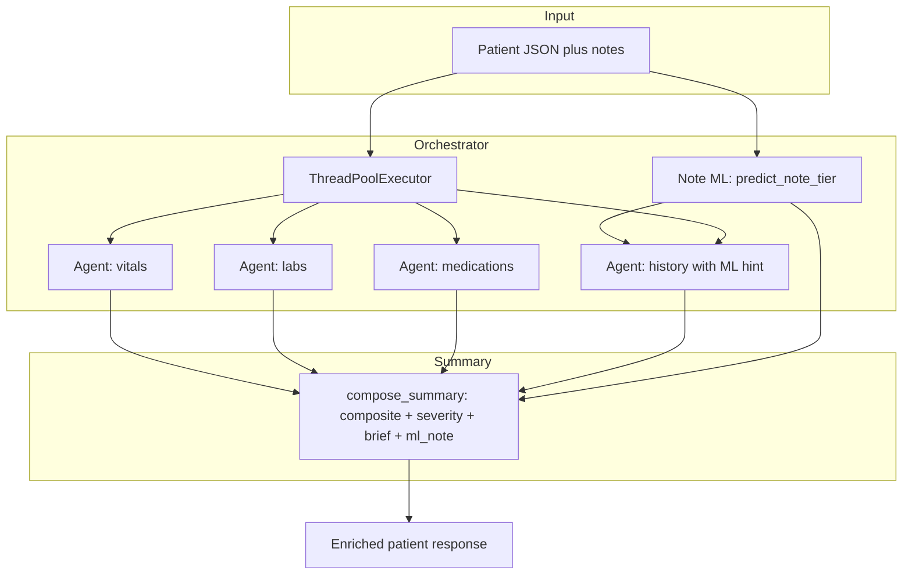

# Clinical Triage Dashboard

A **decision-support** web app for hospital-style triage: it **prioritizes patients** and **surfaces why** they might need attention—using structured data (vitals, labs, medications, history) plus free-text **clinical notes**. It is built for **demos and hackathons**; it is **not** a medical device and does not replace professional judgment.

---

## What the product does

- **Ingests** a patient record: ID, demographics, time-series vitals, labs, med list, comorbidities/allergies, and narrative notes.
- **Runs a multi-signal analysis**: specialized modules score each domain, then a **summary layer** combines them into a **single composite score** and a **RED / AMBER / GREEN** triage band.
- **Adds an ML signal on the note text**: a trained classifier (TF‑IDF + Random Forest) suggests a **risk tier** and **class probabilities** when a model is present—surfaced in the API as `ml_note` and shown in the UI.
- **Presents a dashboard** (React) so clinicians or operators can see **who to look at first**, read **action-oriented bullets**, and drill into **per-domain “evidence”** (JSON from each module).

The app emphasizes **transparency** (you can see rule outputs and, when loaded, model probabilities) and **human-in-the-loop** use: the screen supports review, not autonomous diagnosis.

---

## Agentic architecture (how it works)

“Agentic” here means **orchestrated specialists**: one coordinator runs several **independent analysis agents** in parallel, then a **composer** fuses their outputs. That keeps concerns separated (vitals logic does not need to know medication interaction rules) and makes the system easier to **extend** (e.g. add a new agent without rewiring the whole app).



**Flow in plain terms**

1. **Orchestrator** ([`backend/orchestrator.py`](backend/orchestrator.py)) receives one patient payload.
2. It runs **one note-level ML prediction** first and passes that to the **history** agent (for a consistent boost from text risk) and to the **summary** (for `ml_note` in the API).
3. **Four agents** run **concurrently**: vitals, labs, medications, history—each returns a structured result (flags, sub-scores, interactions, etc.).
4. The **summary agent** ([`backend/agents/summary_agent.py`](backend/agents/summary_agent.py)) **weights** domain scores, assigns **severity** from the composite, builds the **narrative brief** (including suggested actions), and attaches **`ml_note`** metadata.

The **HTTP API** ([`backend/app.py`](backend/app.py)) exposes this pipeline via:

- `POST /api/patient/add` — run the pipeline and **save** to the on-disk store.
- `POST /api/patient/analyze` — same analysis, **no save** (preview in the “Analyze” UI).
- `GET` endpoints for listing patients, one patient, and aggregate **stats** for the dashboard.

For request/response shapes, see [`backend/docs/openapi.yaml`](backend/docs/openapi.yaml).

---

## Tech stack

| Layer | Technology |
|-------|------------|
| **API** | Python 3, Flask, flask-cors |
| **“Agents”** | Plain Python modules + `ThreadPoolExecutor` |
| **ML** | scikit-learn (TfidfVectorizer + RandomForest), optional `models/priority_model.pkl` |
| **Persistence (demo)** | JSON file `backend/data/patients.json` (replaceable with a DB in production) |
| **UI** | React (Vite), client-side fetch to the API base URL |
| **Optional production server** | gunicorn + [`backend/wsgi.py`](backend/wsgi.py) |

---

## Repository layout

| Path | Role |
|------|------|
| [`backend/`](backend/) | Flask app, agents, orchestrator, ML loading, tests |
| [`frontend/`](frontend/) | Vite + React dashboard (list, detail, analyze preview, toasts, dark mode) |
| [`JUDGE_PITCH.md`](JUDGE_PITCH.md) | Short pitch script for demo / judging |
| [`backend/docs/openapi.yaml`](backend/docs/openapi.yaml) | Hand-maintained API overview |

The root [`package.json`](package.json) with `server.js` is **legacy** from an earlier template; the **active** app is `backend/` + `frontend/`.

---

## Run locally (happy path)

**Terminal 1 — API (port 8000)**

```bash
cd backend
source venv/bin/activate
pip install -r requirements.txt
python app.py
```

**Terminal 2 — UI (usually 5173)**

```bash
cd frontend
npm install
npm run dev
```

**Seed demo patients** (with the API running, from `backend/`):

```bash
python -c "from seed_patients import load; load()"
```

Details and troubleshooting: [`backend/README.md`](backend/README.md) and [`frontend/README.md`](frontend/README.md).

---


